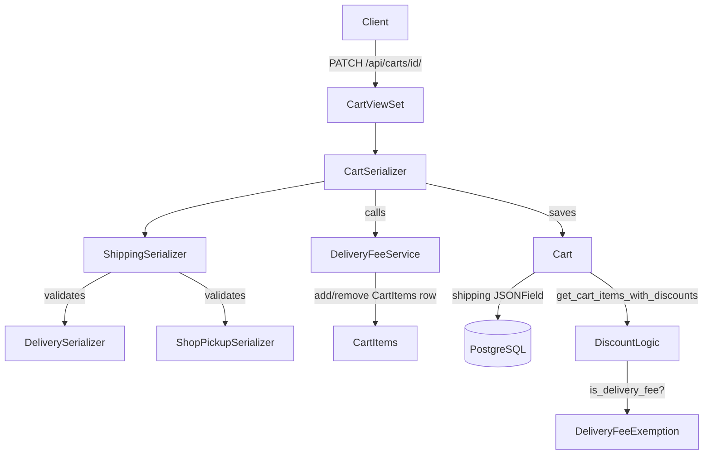

# Design Document: Cart Delivery & Shipping

## Overview

This feature adds shipping/delivery support to the Ameba cart. Users choose between home delivery or shop pickup at checkout. The choice is persisted as a `shipping` JSONField on the `Cart` model. Selecting home delivery automatically adds a fixed €4 `DeliveryFee` `CartItem` that is always excluded from discount calculations. The cart's `state` property is extended with two flags that drive the frontend checkout routing.

The implementation is additive: no existing model fields are removed, no existing API contracts are broken. The `CartViewSet` already supports `PATCH /api/carts/{id}/` via `partial_update`; we extend the `CartSerializer` to accept and validate the new `shipping` field through that same endpoint.

---

## Architecture



The design keeps all new logic inside the existing `api/` app, following the one-file-per-domain convention.

---

## Components and Interfaces

### 1. `ShippingSerializer` (new — `api/serializers/cart.py`)

Validates the `shipping` JSON payload. Contains two optional nested serializers:

```python
class DeliverySerializer(serializers.Serializer):
    direccion = serializers.CharField(label=_('address'))
    ciudad    = serializers.CharField(label=_('city'))
    telefono  = serializers.CharField(label=_('phone'))
    dni       = serializers.CharField(label=_('DNI'))

class ShopPickupSerializer(serializers.Serializer):
    shop = serializers.CharField(label=_('shop'))

class ShippingSerializer(serializers.Serializer):
    delivery   = DeliverySerializer(required=False, allow_null=True)
    shop_pickup = ShopPickupSerializer(required=False, allow_null=True)

    def validate(self, data):
        # Exactly one of delivery / shop_pickup must be present and non-null
        ...
```

Validation rules:
- At least one of `delivery` or `shop_pickup` must be present.
- At most one may be active (non-null) at a time.
- All string fields must be non-empty after stripping whitespace.

### 2. `Cart` model changes (`api/models/cart.py`)

**New field:**
```python
shipping = JSONField(blank=True, null=True, verbose_name=_('shipping'))
```

**New migration:** `api/migrations/0082_cart_shipping.py`

**`state` property** — extended with two new keys:
```python
needs_shipping_selection     = self.shipping is None
can_confirm_or_change_shipping = self.shipping is not None
```

**`get_cart_items_with_discounts` change** — when iterating cart items, if the item is a delivery fee item (`cart_item.item_variant.is_delivery_fee` is `True`), skip the discount lookup and always append `discount: None`.

**`discounts_by_value_desc` change** — return `[]` immediately for delivery-fee item variants.

### 3. `DeliveryFeeService` (new — `api/helpers/delivery_fee.py`)

A small stateless helper that encapsulates add/remove logic so it can be called from both the serializer and any future code paths:

```python
DELIVERY_FEE_CENTS = 400

def ensure_delivery_fee(cart: Cart) -> None:
    """Add the DeliveryFee CartItem if not already present."""
    ...

def remove_delivery_fee(cart: Cart) -> None:
    """Remove the DeliveryFee CartItem if present."""
    ...
```

### 4. `ItemVariant` — delivery fee flag

Rather than creating a new model, we add a boolean `is_delivery_fee` field to `ItemVariant`:

```python
is_delivery_fee = models.BooleanField(default=False, verbose_name=_('is delivery fee'))
```

A single `DeliveryFee` `Item` + `ItemVariant` is created via a data migration (price = 4.00, stock = -1, `is_delivery_fee = True`). The service helper looks up this variant by `is_delivery_fee=True`.

**New migration:** `api/migrations/0083_itemvariant_is_delivery_fee.py`

### 5. `CartSerializer` changes (`api/serializers/cart.py`)

- Add `shipping` as a writable field backed by `ShippingSerializer`.
- Add `shipping` to `CartCheckoutSerializer.fields`.
- In `update()`: after saving the shipping value, call `ensure_delivery_fee` or `remove_delivery_fee` based on whether `delivery` is present.

### 6. `CartViewSet` — no changes needed

`PATCH /api/carts/{id}/` already routes to `partial_update` → `CartSerializer.update`. No new endpoints or actions are required.

---

## Data Models

### `Cart` (modified)

| Field | Type | Notes |
|---|---|---|
| `shipping` | `JSONField(null=True)` | New field. Stores `Shipping` object or `null`. |

### `Shipping` JSON schema

```json
{
  "delivery": {
    "direccion": "string",
    "ciudad": "string",
    "telefono": "string",
    "dni": "string"
  },
  "shop_pickup": null
}
```

or

```json
{
  "delivery": null,
  "shop_pickup": { "shop": "string" }
}
```

At most one key is non-null at a time.

### `ItemVariant` (modified)

| Field | Type | Notes |
|---|---|---|
| `is_delivery_fee` | `BooleanField(default=False)` | New flag. Exactly one variant has this set to `True`. |

### `CartItems` (unchanged)

The delivery fee is stored as a regular `CartItems` row linking the delivery-fee `ItemVariant` to the `Cart`. No schema change needed.

---

## Correctness Properties

*A property is a characteristic or behavior that should hold true across all valid executions of a system — essentially, a formal statement about what the system should do. Properties serve as the bridge between human-readable specifications and machine-verifiable correctness guarantees.*

### Property 1: Delivery fee present if and only if (iff) delivery is active

*For any* cart, after setting `shipping` to a delivery object, the cart's item variants must include exactly one delivery-fee item variant; and after switching to shop pickup, the cart's item variants must contain no delivery-fee item variant.

**Validates: Requirements 2.1, 2.2, 3.5, 3.6**

---

### Property 2: Delivery fee always excluded from discounts

*For any* cart with an active discount code and a delivery-fee item in its items, `get_cart_items_with_discounts` must return the delivery-fee entry with `discount: None`, regardless of what discounts are attached to other items.

**Validates: Requirements 2.4, 2.5, 6.1, 6.2**

---

### Property 3: Cart amount includes delivery fee at full price

*For any* cart with delivery active and any discount code applied, `cart.amount` must equal the sum of discounted non-fee items plus exactly 400 cents (never less).

**Validates: Requirements 2.3, 6.3**

---

### Property 4: Shipping serializer round-trip

*For any* valid `Shipping` object (either delivery or shop_pickup variant), serializing it and then deserializing the result must produce an equivalent object.

**Validates: Requirements 1.2, 1.3, 1.4, 5.4, 5.5**

---

### Property 5: Invalid shipping payloads are rejected

*For any* shipping payload that is missing required fields or has empty-string values, `ShippingSerializer.is_valid()` must return `False` and the cart must remain unchanged.

**Validates: Requirements 3.2, 3.3, 3.4**

---

### Property 6: Cart state flags are consistent with shipping field

*For any* cart, `needs_shipping_selection` is `True` if and only if `shipping` is `None`, and `can_confirm_or_change_shipping` is `True` if and only if `shipping` is not `None`. The two flags are always logical complements.

**Validates: Requirements 4.1, 4.2, 4.3**

---

### Property 7: CartSerializer exposes shipping field correctly

*For any* cart, the serialized output of `CartSerializer` must include a `shipping` key whose value is `null` when `cart.shipping` is `None`, and contains all expected sub-fields when set.

**Validates: Requirements 5.1, 5.3, 5.4, 5.5**

---

## Error Handling

| Scenario | HTTP Status | Detail |
|---|---|---|
| `shipping` payload missing required string field | 400 | DRF validation error from `ShippingSerializer` |
| `shipping` payload has empty/whitespace string | 400 | Custom validator in `DeliverySerializer` / `ShopPickupSerializer` |
| Both `delivery` and `shop_pickup` are non-null | 400 | `ShippingSerializer.validate()` raises `ValidationError` |
| Neither `delivery` nor `shop_pickup` present | 400 | `ShippingSerializer.validate()` raises `ValidationError` |
| `PATCH` on a cart the user doesn't own | 403 | Existing `CartPermission` |
| Unauthenticated `PATCH` on a cart | 401 | Existing `CartPermission` |

No new exception classes are needed; standard DRF `ValidationError` is sufficient.

---

## Testing Strategy

Tests live in `api/tests/test_cart_shipping.py` and extend `BaseTest`.

### Unit tests

- `ShippingSerializer` accepts valid delivery payload.
- `ShippingSerializer` accepts valid shop_pickup payload.
- `ShippingSerializer` rejects payload with both keys non-null.
- `ShippingSerializer` rejects payload with neither key.
- `ShippingSerializer` rejects delivery payload with empty `direccion`.
- `DeliveryFeeService.ensure_delivery_fee` is idempotent (calling twice doesn't add two rows).
- `DeliveryFeeService.remove_delivery_fee` is a no-op when no fee is present.
- `Cart.state` includes `needs_shipping_selection` and `can_confirm_or_change_shipping`.
- `CartSerializer` output includes `shipping: null` when unset.
- `CartCheckoutSerializer` output includes `shipping` field.

### Property-based tests

Use [Hypothesis](https://hypothesis.readthedocs.io/) (already available in the Python ecosystem; add to dev dependencies).

Each property test runs a minimum of 100 examples.

**Property test 1** — `test_delivery_fee_present_iff_delivery_active`
Generate random valid shipping objects (delivery or shop_pickup). After a PATCH, assert delivery-fee presence matches shipping type.
`# Feature: cart-delivery-shipping, Property 1: Delivery fee present if and only if (iff) delivery is active`

**Property test 2** — `test_delivery_fee_excluded_from_discounts`
Generate random carts with random discount codes and a delivery-fee item. Assert `get_cart_items_with_discounts` always returns `discount: None` for the fee item.
`# Feature: cart-delivery-shipping, Property 2: Delivery fee always excluded from discounts`

**Property test 3** — `test_cart_amount_includes_full_delivery_fee`
Generate random item sets with random discount codes and delivery active. Assert `cart.amount >= 400` and the fee contributes exactly 400 cents.
`# Feature: cart-delivery-shipping, Property 3: Cart amount includes delivery fee at full price`

**Property test 4** — `test_shipping_serializer_round_trip`
Generate random valid `Shipping` dicts. Serialize then deserialize and assert structural equality.
`# Feature: cart-delivery-shipping, Property 4: Shipping serializer round-trip`

**Property test 5** — `test_invalid_shipping_rejected`
Generate shipping dicts with at least one required field empty or missing. Assert `is_valid()` returns `False`.
`# Feature: cart-delivery-shipping, Property 5: Invalid shipping payloads are rejected`

**Property test 6** — `test_state_flags_are_complements`
Generate random carts with `shipping` set to `None` or a valid object. Assert `needs_shipping_selection == (not can_confirm_or_change_shipping)`.
`# Feature: cart-delivery-shipping, Property 6: Cart state flags are consistent with shipping field`

**Property test 7** — `test_cart_serializer_shipping_field`
Generate random carts. Assert serialized output always contains a `shipping` key with the correct structure.
`# Feature: cart-delivery-shipping, Property 7: CartSerializer exposes shipping field correctly`
